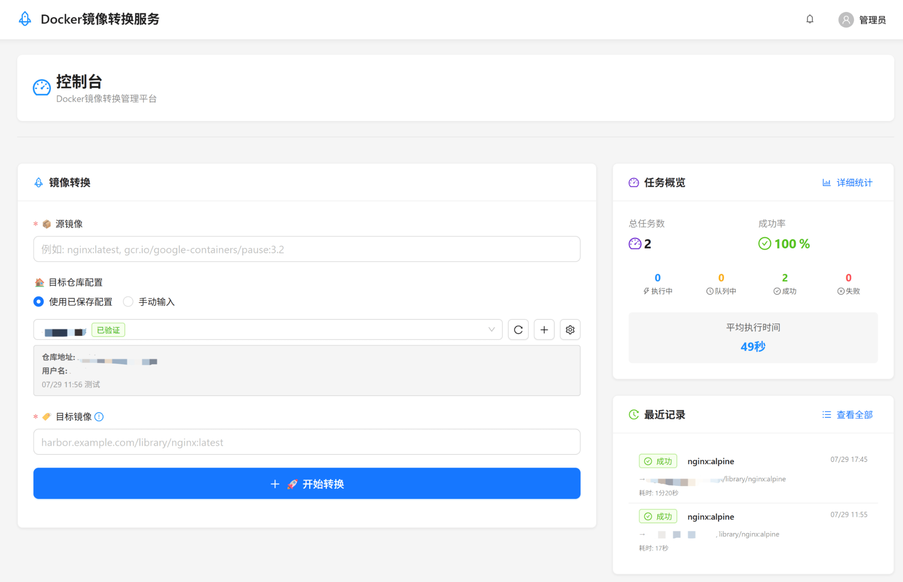

# 🐳 Docker镜像转换服务

[](https://opensource.org/licenses/MIT)
[](https://golang.org/)
[](https://reactjs.org/)
[](https://www.docker.com/)
[](https://github.com/cflmflj/docker-transformer/releases)

一个功能完整、易于使用的Docker镜像跨仓库转换服务，专为解决网络受限环境下的镜像获取问题而设计。



## ✨ 核心特性

### 🚀 镜像转换
- **多源仓库支持**: Docker Hub、GCR、Quay.io等主流镜像仓库
- **智能镜像解析**: 自动补全镜像标签，支持多种镜像名称格式
- **异步任务处理**: 后台执行转换任务，支持实时进度监控
- **自动目标镜像生成**: 根据源镜像和目标仓库自动生成规范的目标镜像名称

### 📊 任务管理
- **实时任务监控**: 查看当前执行任务的详细进度和日志
- **任务队列管理**: 支持多任务排队，可调整优先级
- **状态追踪**: 完整的任务状态生命周期管理
- **错误处理**: 详细的错误信息和重试机制

### 🏪 仓库配置
- **多仓库配置**: 支持保存和管理多个目标仓库配置
- **连接测试**: 验证仓库连接和认证信息
- **加密存储**: 敏感信息采用加密存储
- **配置复用**: 快速选择已保存的仓库配置

### 🔐 安全认证
- **Token认证机制**: 简单而安全的认证方式
- **会话管理**: 安全的登录状态管理
- **权限控制**: 基于Token的访问控制

### 📝 历史记录
- **完整转换历史**: 记录所有转换操作的详细信息
- **状态统计**: 成功率、耗时统计等
- **搜索筛选**: 支持按镜像名称、状态、时间筛选

### 🎨 现代化界面
- **响应式设计**: 支持桌面和移动设备访问
- **实时更新**: 任务状态和进度实时刷新
- **直观操作**: 清晰的操作流程和状态反馈

## 🚀 快速开始

### 一键部署（推荐）

```bash
# 下载并运行一键部署脚本
curl -fsSL https://raw.githubusercontent.com/cflmflj/docker-transformer/main/deploy.sh | bash

# 或者使用自定义配置
./deploy.sh -t your-custom-token -p 9090
```

### 使用Docker Compose

```bash
# 下载配置文件
wget https://raw.githubusercontent.com/cflmflj/docker-transformer/main/docker-compose.yml

# 启动服务
docker-compose up -d

# 访问服务
open http://localhost:8080
```

### 使用Docker

```bash
docker run -d \
  --name docker-transformer \
  -p 8080:8080 \
  -v /var/run/docker.sock:/var/run/docker.sock \
  -v transformer_data:/app/data \
  ghcr.io/cflmflj/docker-transformer:latest
```

### 默认登录信息
- **访问地址**: http://localhost:8080
- **默认Token**: `docker-transformer`

> ⚠️ **安全提醒**: 首次登录后请立即修改默认Token

## 🛠️ 技术架构

### 后端技术栈
- **[Go 1.23+](https://golang.org/)**: 高性能后端服务
- **[Gin Framework](https://gin-gonic.com/)**: 轻量级Web框架
- **[SQLite](https://www.sqlite.org/)**: 轻量级数据库
- **[Docker SDK](https://docs.docker.com/engine/api/sdk/)**: 官方Docker操作SDK

### 前端技术栈
- **[React 18](https://reactjs.org/)**: 现代化前端框架
- **[Ant Design 5](https://ant.design/)**: 企业级UI组件库
- **[Vite](https://vitejs.dev/)**: 快速构建工具

### 部署支持
- **Docker**: 容器化部署
- **Docker Compose**: 一键部署
- **多架构支持**: AMD64和ARM64

## 📁 项目结构

```
docker-transformer/
├── 📄 main.go                    # 主程序入口
├── 📁 config/                    # 配置管理
├── 📁 database/                  # 数据库相关
├── 📁 handlers/                  # API处理器
├── 📁 models/                    # 数据模型
├── 📁 services/                  # 业务逻辑层
├── 📁 utils/                     # 工具函数
├── 📁 web/                       # 前端代码
│   ├── 📁 src/
│   │   ├── 📁 components/        # React组件
│   │   ├── 📁 pages/             # 页面组件
│   │   ├── 📁 contexts/          # React Context
│   │   ├── 📁 services/          # API服务
│   │   ├── 📁 utils/             # 工具函数
│   │   └── 📁 assets/            # 静态资源
│   ├── 📄 package.json           # 前端依赖配置
│   ├── 📄 vite.config.js         # Vite构建配置
│   └── 📁 dist/                  # 构建产物（构建时生成，嵌入到Go二进制）
├── 🐳 Dockerfile                # Docker构建文件
├── 🐳 docker-compose.yml        # Docker Compose配置
└── 📚 docs/                     # 文档目录
```

## 📚 文档

- **[发布说明](./RELEASE_NOTES.md)** - v1.0.0版本详细发布说明
- **[用户指南](./USER_GUIDE.md)** - 详细的使用说明和最佳实践
- **[部署指南](./DEPLOYMENT.md)** - 完整的部署和运维指南
- **[API文档](./API.md)** - RESTful API接口文档
- **[开发指南](./DEVELOPMENT.md)** - 开发环境搭建和贡献指南

## 🚀 使用示例

### 基本转换流程

1. **登录系统**
   ```
   访问: http://localhost:8080
   Token: docker-transformer
   ```

2. **配置转换任务**
   ```
   源镜像: nginx:latest
   目标仓库: harbor.company.com
   目标镜像: harbor.company.com/transform/nginx:latest
   ```

3. **执行转换**
   - 系统自动拉取源镜像
   - 重新标记为目标镜像
   - 推送到目标仓库
   - 显示转换结果

### 支持的镜像格式

```bash
# 基础格式（自动补全latest标签）
nginx

# 标准格式
nginx:1.20
redis:alpine

# 完整路径格式  
docker.io/library/nginx:latest
gcr.io/google-containers/pause:3.2
quay.io/prometheus/prometheus:v2.40.0
```

## 🔧 配置说明

### 环境变量

| 变量名 | 默认值 | 说明 |
|--------|--------|------|
| `PORT` | `8080` | 服务监听端口 |
| `GIN_MODE` | `release` | Gin运行模式（debug/release） |
| `LOG_LEVEL` | `info` | 日志级别（debug/info/warn/error） |
| `DB_PATH` | `/app/data/transform.db` | SQLite数据库文件路径 |
| `DEFAULT_TOKEN` | `docker-transformer` | 默认认证Token |

### 数据持久化

服务使用SQLite数据库存储：
- 用户认证信息
- 仓库配置（加密存储）
- 转换历史记录
- 任务状态信息

数据库文件位置：`/app/data/transform.db`

## 🔒 安全考虑

- **Token认证**: 使用安全的Token认证机制
- **密码加密**: 仓库密码采用AES加密存储
- **会话管理**: 安全的登录状态管理
- **权限控制**: 基于Token的API访问控制
- **网络隔离**: 建议部署在安全的网络环境中

## 🔍 故障排除

### 常见问题

1. **容器启动失败**
   ```bash
   # 检查Docker是否运行
   docker info
   
   # 检查容器状态
   docker-compose ps
   
   # 查看启动日志
   docker-compose logs docker-transformer
   ```

2. **Docker socket权限问题**
   ```bash
   # 当前配置已经设置为使用root用户运行容器
   # 如果仍有问题，重启服务
   docker-compose down
   docker-compose up -d
   ```

3. **镜像拉取失败**
   - 检查网络连接和DNS解析
   - 验证镜像名称格式是否正确
   - 确认源镜像仓库可访问

4. **推送到目标仓库失败**
   - 验证目标仓库地址和认证信息
   - 确认具有推送权限
   - 检查目标项目/命名空间是否存在

详细故障排除请参考完整文档。

## 🚀 开发

### 本地开发环境

#### 后端开发

```bash
# 1. 克隆项目
git clone https://github.com/cflmflj/docker-transformer.git
cd docker-transformer

# 2. 安装Go依赖
go mod download

# 3. 运行后端服务
go run main.go
```

#### 前端开发

```bash
# 1. 进入前端目录
cd web

# 2. 安装Node.js依赖
npm install

# 3. 启动开发服务器
npm run dev
```

#### 构建生产版本

```bash
# 1. 构建前端
cd web
npm run build

# 2. 构建后端（包含前端资源）
cd ..
go build -o docker-transformer

# 3. 构建Docker镜像
docker build -t docker-transformer:local .
```

### 贡献指南

1. Fork本项目
2. 创建功能分支 (`git checkout -b feature/amazing-feature`)
3. 提交更改 (`git commit -m 'Add some amazing feature'`)
4. 推送到分支 (`git push origin feature/amazing-feature`)
5. 创建Pull Request

## 📊 版本历史

- **v1.0.0** (2025-01-28) - 首次正式发布
  - 完整的镜像转换功能
  - 现代化Web界面
  - 异步任务管理
  - 仓库配置管理
  - 历史记录和统计

## 📄 许可证

本项目采用 [MIT 许可证](./LICENSE) - 详见LICENSE文件。

## 🤝 支持与反馈

### 获取帮助
- **📖 在线文档**: 查阅完整的使用文档
- **🐛 Bug报告**: [GitHub Issues](https://github.com/cflmflj/docker-transformer/issues)
- **💡 功能建议**: [GitHub Discussions](https://github.com/cflmflj/docker-transformer/discussions)

### 社区
- **⭐ Star项目**: 如果这个项目对您有帮助，请给个Star
- **🔗 分享**: 将项目分享给需要的朋友
- **📝 反馈**: 告诉我们您的使用体验

---

<div align="center">

**🎉 感谢使用Docker镜像转换服务！**

Made with ❤️ by [cflmflj](https://github.com/cflmflj)

[](https://github.com/cflmflj/docker-transformer/stargazers)
[](https://github.com/cflmflj/docker-transformer/network/members)

</div> 